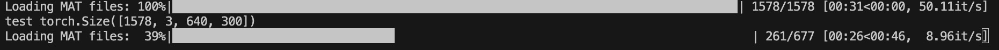
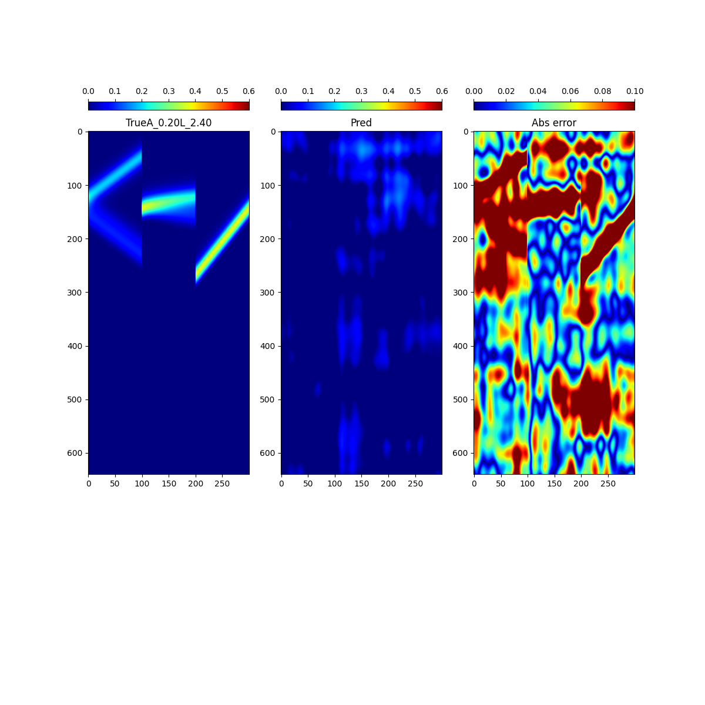
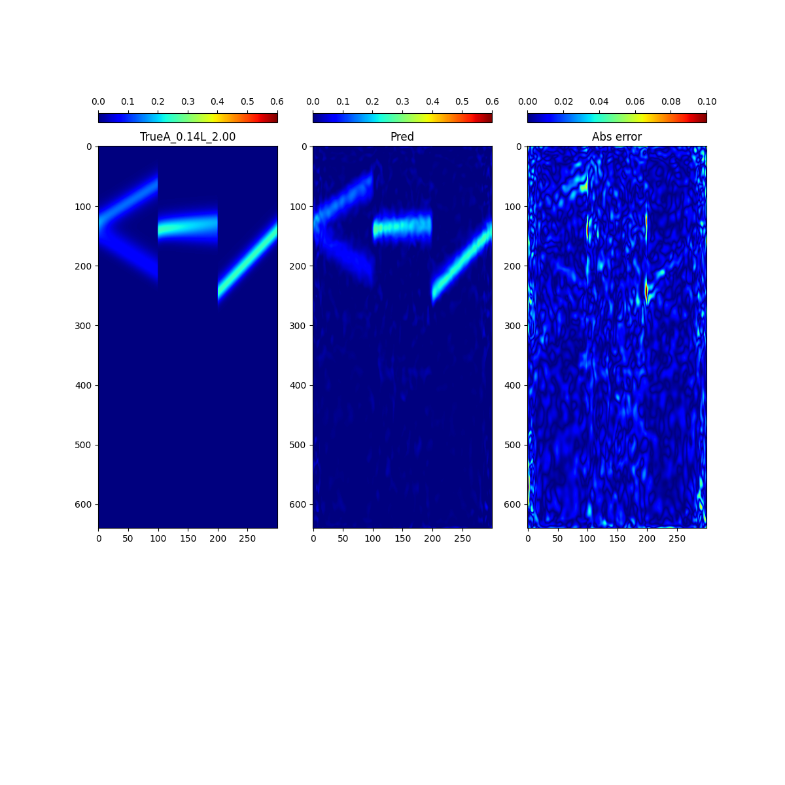

## There are the description for operator learning TASKS 


### what is the model's input and outputs?

Here we use the Operator learning, the operator learns a mapping from a $ \eta (x_{0},t_{0}) -> \eta (x,t) $, the $x_{0}$ is a type of image  about (100,3), which means that 100 is the discrete elements in 3 type area. $t_{0}$ is the 1 which means that the initial step in the simulation.
Therefore, we train the opertor $G(*,t,C_{i})$, which has a mapping relationship as followng, $C_{i}$ means the 3 type area:s

$$\eta (x_{0:99},t_{0},C_{i}) \overset{G}{\rightarrow} \eta (x_{0:99},t,C_{i}),t\in [0,639] , i \in [0,2]$$ 

note: the 0:99 is the discrete x coords.

Above is the opeartor learning in one case. In order to simlate more cases, we use the DeepOnet structure.

Brannch net is mapping from the different the value （A and L）to a scalar.

$$ \eta(x,t_{0:99},C) = Brann(A,L) \circ  G(*,t_{0},C)$$

The model‘ output is [640，100，3], the input is [1,100,3]


### there is two types of tasks , one is the meeting of NCHD  

    For  NCHD DATA:     
    https://drive.google.com/file/d/1X9fewAe40-ySEJjzard64RyO0klrHlJo/view?usp=drive_link.

    For OCEAN DATA: It is not published now, please wait for months.


## How to run it ?
You could put the data and release them in Data/Trian/Train_1d
```python
bash Shell/meeting/modes_128_1d/3_19_1.sh
```
And it could be shown like this, it will be successful:



### As for result, you could see the result for epoch =0 
#### epoch=0



#### epoch=2000


